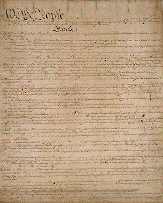

   
 

* "The men American people admire most extravagantly are the most daring liars; the men they detest most violently are those who try and tell them the truth" --H. L. Mencken

* "Laws that forbid the carrying of arms...disarm only those who are neither inclined nor determined to commit crimes... Such laws make things worse for the assaulted and better for the assailants; they serve rather to encourage than to prevent homicides, for an unarmed man may be attacked with greater confidence than an armed man."  
**-- Thomas Jefferson (Quoting Cesare Beccaria)**  
   
* "I have said that the Declaration of Independence is the ring-bolt to the chain of your nation's destiny; so, indeed, I regard it. The principles contained in that instrument are saving principles. Stand by those principles, be true to them on all occasions, in all places, against all foes, and at whatever cost."  
**-- Frederick Douglass, Speech Given at Rochester, New York [July 5, 1852]**  
   
* "The whole gospel of Karl Marx can be summed up in a single sentence: Hate the man who is better off than you are. Never under any circumstances admit that his success may be due to his own efforts, to the productive contribution he has made to the whole community. Always attribute his success to the exploitation, the cheating, the more or less open robbery of others. Never under any circumstances admit that your own failure may be owing to your own weakness, or that the failure of anyone else may be due to his own defects – his laziness, incompetence, improvidence, or stupidity."  
**-- Henry Hazlitt**  
   
* "The American Republic will endure until the day Congress discovers that it can bribe the public with the public’s money."  
**-- Alexis de Tocqueville**  
   
* "Democracy extends the sphere of individual freedom, socialism restricts it. Democracy attaches all possible value to each man; socialism makes each man a mere agent, a mere number. Democracy and socialism have nothing in common but one word: equality. But notice the difference: while democracy seeks equality in liberty, socialism seeks equality in restraint and servitude."  
**-- Alexis de Tocqueville**  
 
* "The Union soldiers in that battle actually fought against self-determination; it was the Confederates who fought for the right of their people to govern themselves. What was the practical effect of the battle of Gettysburg? What else than the destruction of the old sovereignty of the States, i.e., of the people of the States? The Confederates went into battle free; they came out with their freedom subject to the supervision and veto of the rest of the country—and for nearly twenty years that veto was so effective that they enjoyed scarcely more liberty, in the political sense, than so many convicts in the penitentiary."  
**-- Henry Louis Mencken, “Five Men at Random,” in “Prejudices: Third Series,” 1922.**  
   
* "As democracy is perfected, the office of President represents, more and more closely, the inner soul of the people. On some great and glorious day the plain folks of the land will reach their heart's desire at last, and the White House will be occupied by a downright moron."  
**-- H.L. Mencken, The Baltimore Evening Sun, July 26, 1920**  
   
* "In spite of its alluring name, the welfare state stands or falls by compulsion. It is compulsion imposed upon us with the state's power to punish noncompliance. Once this is clear, it is equally clear that the welfare state is an evil the same as every restriction of freedom. "  
**-- Wilhelm Ropke**  
   
* "A major source of objection to a free economy is precisely that ... it gives people what they want instead of what a particular group thinks they ought to want. Underlying most arguments against the free market is a lack of belief in freedom itself."  
**-- Milton Friedman**  
 
* "We hang the petty thieves and appoint the great ones to public office"  
**-- Aesop**  
   
* "It is inaccurate to say that I hate everything. I am strongly in favor of common sense, common honesty, and common decency. This makes me forever ineligible for public office. "  
**-- H. L. Mencken, [<u>http://www.quotationspage.com/quotes/H._L._Mencken/</u>](http://www.quotationspage.com/quotes/H._L._Mencken/), (1880 - 1956)**  
   
* "The only good bureaucrat is one with a pistol at his head. Put it in his hand and it's good-by to the Bill of Rights."  
**-- H.L. Mencken**  
   
* "Every decent man is ashamed of the government he lives under."  
**-- H. L. Mencken**  
   
*  "The most dangerous man to any government is the man who is able to think things out for himself, without regard to the prevailing superstitions and taboos."  
**-- H.L. Mencken**  
   
* "I can find no warrant for such an appropriation in the Constitution, and I do not believe that the power and duty of the General Government ought to be extended to the relief of individual suffering which is in no manner properly related to the public service or benefit."  
**-- President Grover Cleveland vetoing a bill for charity relief (18 Congressional Record 1875 [1877]**  
   
* "The sole end for which mankind are warranted, individually or collectively, in interfering with the liberty of action of any of their number, is self-protection."  
**-- John Stuart Mill**  
    
* "It could probably be shown by facts and figures that there is no distinctly native American criminal class except Congress."  
**-- Mark Twain, 1894**  
   
* "If a nation values anything more than freedom, it will lose its freedom; and the irony of it is that, if it is comfort or money it values more, it will lose that too."  
**-- William Somerset Maughan, 1941**  
   
* "Democracy is a form of worship. It is the worship of jackals by jackasses."  
**-- H.L. Mencken**  
   
* In a famous incident in 1854, President Franklin Pierce was pilloried for vetoing an extremely popular bill intended to help mentally ill. The act was championed by the renowned 19th century social reformer Dorothea Dix. In the face of heavy criticism, Pierce countered: "I cannot find any authority in the Constitution for the public charity." To approve such spending, argued Pierce, "would be contrary to the letter and the spirit of the Constitution and subversive to the whole theory upon which the Union of these States is founded."  
   
* "Study the Constitution. Let it be preached from the pulpit, proclaimed in legislatures, and enforced in courts of justice."  
**-- Abraham Lincoln**  
   
* "The only freedom which deserves the name, is that of pursuing our own good in our own way, so long as we do not attempt to deprive others of theirs, or impede their efforts to obtain it."  
**--John Stuart Mill**  
   
* "Life, liberty, and property do not exist because men have made laws. On the contrary, it was the fact that life, liberty, and property existed beforehand that caused men to make laws in the first place."  
**-- Frederic Bastiat**  
   
* "A democracy cannot exist as a permanent form of government. It can only exist until the voters discover that they can vote themselves largesse from the public treasury. From that moment on, the majority always votes for the candidates promising the most benefits from the public treasury, with the result that a democracy always collapses over loose fiscal policy, always followed by a dictatorship."  
**-- Professor Alexander Tytler over 200 years ago**  
   
* "If Congress can determine what constitutes the general welfare and can appropriate money for its advancement, where is the limitation to carrying into execution whatever can be effected by money?"  
**-- South Carolina Senator William Draden 1828**  
   
* "When men get in the habit of helping themselves to the property of others, they cannot easily be cured of it."  
**-- The New York Times, in a 1909 editorial opposing the very first income tax**  
   
* "For me to go into politics would be like sending a virgin into a house of ill-repute."  
**-- H.L. Mencken**  
   
* "The State is great fiction by which everyone seeks to live at the expense of everyone else."  
**-- Frederic Bastiat**  
   
* "Imagine, if you will, that I am an idiot.  
Then, imagine that I am also a Congressman.  
But, alas, I repeat myself."  
**-- Mark Twain**  
   
* "To be GOVERNED is to be kept in sight, inspected, spied upon, directed, law-driven, numbered, enrolled, indoctrinated, preached at, controlled, estimated, valued, censured, commanded, by creatures who have neither the right, nor the wisdom, nor the virtue to do so. To be GOVERNED is to be at every operation, at every transaction, noted, registered, enrolled, taxed, stamped, measured, numbered, assessed, licensed, authorized, admonished, forbidden, reformed, corrected, punished. It is, under pretext of public utility, and in the name of the general interest, to be placed under contribution, trained, ransomed, exploited, monopolized, extorted, squeezed, mystified, robbed; then, at the slightest resistance, the first word of complaint, to be repressed, fined, despised, harassed, tracked, abused, clubbed, disarmed, choked, imprisoned, judged, condemned, shot, deported, sacrificed, sold, betrayed; and, to crown all, mocked, ridiculed, outraged, dishonored. That is government; that is its justice; that is its morality."  
**--French socialist Pierre-Joseph Proudhon, General Idea of the Revolution in the Nineteenth Century, trans. John Beverley Robinson (London: Freedom Press, 1923), p.294**  
   
* "Classifications and distinctions based on race or color have no moral or legal validity in our society. They are contrary to our constitution and laws."  
**-- Thurgood Marshall, 1947**  
   
*  "It is not the function of our Government to keep the citizen from falling into error; it is the function of the citizen to keep the Government from falling into error."  
**-- Robert Houghwout Jackson, Associate Justice of the U.S. Supreme Court and Chief Judge at the War-Crimes Tribunal in Nuremberg**  
 
* "I would have government defend the life and property of all citizens equally; protect all willing exchange; suppress and penalize all fraud, all misrepresentation, all violence, all predatory practices; invoke a common justice under law; and keep the records incidental to these functions. Even this is a bigger assignment than governments, generally, have proven capable of. Let governments do these things and do them well. Leave all else to men in free and creative effort."  
**-- Leonard E. Read, Freedom Daily, page 35, March 2001**  
   
* "The moment a person forms a theory his imagination sees in every object only the traits which favor that theory."  
**-- Thomas Jefferson, in a letter to Charles Thompson, September 20, 1787 in The Works of Thomas Jefferson, edited Paul L. Ford, Volume 5, Page 352, New York: Knickerbocker Press, 1904**  
   
* "Democracy extends the sphere of individual freedom, socialism restricts it. Democracy attaches all possible value to each man; socialism makes each man a mere agent, a mere number. Democracy and socialism have nothing in common but one word: equality. But notice the difference: while democracy seeks equality in liberty, socialism seeks equality in restraint and servitude."  
**-- Alexis de Tocqueville**  
   
* "Of all tyrannies a tyranny exercised for the good of its victims may be the most oppressive. It may be better to live under robber barons than under omnipotent moral busybodies. The robber baron's cruelty may sometimes sleep, his cupidity may at some point be satiated; but those who torment us for our own good will torment us without end for they do so with the approval of their own conscience. They may be more likely to go to Heaven yet at the same time likelier to make a Hell of earth. This very kindness stings with intolerable insult. To be 'cured' against one's will and cured of states which we may not regard as disease is to be put on a level of those who have not yet reached the age of reason or those who never will; to be classed with infants, imbeciles, and domestic animals. But to be punished, however severely, because we have deserved it, because we 'ought to have known better,' is to be treated as a human person made in God's image."  
**-- C.S. Lewis**  

  
