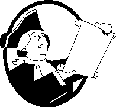

  

###Constitutional Limitations on Government

 

* "As democracy is perfected, the office of the President represents, more and more closely, the inner soul of the people. On some great and glorious day, the plain folks of the land will reach their heart's desire at last and the White House will be occupied by a downright fool and complete narcissistic moron."  
**-- H.L. Mencken, the Baltimore Evening Sun, July 26, 1920**  
 
* "The government of the United States is a definite government, confined to specified objects. It is not like state governments, whose powers are more general. Charity is no part of the legislative duty of the government."  
**-- James Madison, speech in the House of Representatives, January 10, 1794**  
 
* "Democracy will soon degenerate into an anarchy; such an anarchy that every man will do what is right in his own eyes and no man's life or property or reputation or liberty will be secure, and every one of these will soon mould itself into a system of subordination of all the moral virtues and intellectual abilities, all the powers of wealth, beauty, wit, and science, to the wanton pleasures, the capricious will, and the execrable cruelty of one or a very few."  
**-- John Adams, An Essay on Man's Lust for Power (1763)**  
 
* "Neither the wisest constitution nor the wisest laws will secure the liberty and happiness of a people whose manners are universally corrupt."  
**-- Samuel Adams Essay in the Public Advertiser, 1749**  
 
* "It is the responsibility of the patriot to protect his country from its government."  
**-- Thomas Paine**  
 
* "Resolved, that the several States composing the United States of America, are not united on the principle of unlimited submission to their general government . . . whensoever the general government assumes undelegated powers, its acts are unauthoritative, void, and of no force."  
**-- Thomas Jefferson, /Draft Kentucky Resolutions/ [1798]**  
 
* "To consider the judges as the ultimate arbiters of all constitutional questions [is] a very dangerous doctrine indeed, and one which would place us under the despotism of an oligarchy."  
**-- Thomas Jefferson letter to William C. Jarvis, 1820.**  
 
* "That no free government, or the blessing of liberty, can be preserved to any people but by a firm adherence to justice, moderation, temperance, frugality, and virtue, and by frequent recurrence to fundamental principles."  
**-- George Mason, Virginia Declaration of Rights, Section XV [1776]**  
 
* "The issue today is the same as it has been throughout all history, whether man shall be allowed to govern himself or be ruled by a small elite."  
**-- Thomas Jefferson**  
 
* "Dependence begets subservience and venality, suffocates the germ of virtue, and prepares fit tools for the designs of ambition."  
**-- Thomas Jefferson**  
 
* "If ever time should come, when vain and aspiring men shall possess the highest seats in Government, our country will stand in need of its experienced patriots to prevent its ruin."  
**-- Samuel Adams (1722–1803)**  
 
* "...the opinion which gives to the judges the right to decide what laws are constitutional and what not, not only for themselves in their own sphere of action but for the Legislature and Executive also in their spheres, would make the Judiciary a despotic branch."  
**-- Thomas Jefferson**  
 
* "Nip the shoots of arbitrary power in the bud, is the only maxim which can ever preserve the liberties of any people. When the people give way, their deceivers, betrayers, and destroyers press upon them so fast, that there is no resisting afterwards. The nature of the encroachment upon the American constitution is such, as to grow every day more and more encroaching. Like a cancer, it eats faster and faster every hour. The revenue creates pensioners, and the pensioners urge for more revenue. The people grow less steady, spirited, and virtuous, the seekers more numerous and more corrupt, and every day increases the circles of their dependents and expectants, until virtue, integrity, public spirit, simplicity, and frugality, become the objects of ridicule and scorn, and vanity, luxury, foppery, selfishness, meanness, and downright venality swallow up the whole society. "  
**-- John Adams, Novanglus Letters, 1774**  
 
* "I have sworn upon the altar of God, eternal hostility against every form of tyranny over the mind of man."  
**-- Thomas Jefferson, Letter to Dr. Benjamin Rush [September 23, 1800]**  
 
* "I am a mortal enemy to arbitrary government and unlimited power. I am naturally very jealous for the rights and liberties of my country, and the least encroachment of those invaluable privileges is apt to make my blood boil."  
**-- Ben Franklin**  
 
* "The greatest [calamity] which could befall [us would be] submission to a government of unlimited powers."  
**-- Thomas Jefferson, [<u>Declaration and Protest of Virginia</u>](http://avalon.law.yale.edu/19th_century/jeffdec1.asp), [1825]**  
 
* "I am for doing good to the poor, but I differ in opinion of the means. I think the best way of doing good to the poor, is not making them easy in poverty, but leading or driving them out of it. In my youth I travelled much, and I observed in different countries, that the more public provisions were made for the poor, the less they provided for themselves, and of course became poorer. And, on the contrary, the less was done for them, the more they did for themselves, and became richer."  
**-- Benjamin Franklin**  
 
* "I consider the foundation of the [Federal] Constitution as laid on this ground: That "all powers not delegated to the United States, by the Constitution, nor prohibited by it to the States, are reserved to the States or to the people." [10th Amendment] To take a single step beyond the boundaries thus specifically drawn around the powers of Congress is to take possession of a boundless field of power, no longer susceptible of any definition."  
**-- Thomas Jefferson, "Opinion on the Constitutionality of a National Bank" [February 15, 1791]**  
 
* "Charity is no part of the legislative duty of the government."  
**-- James Madison**  
 
* "[G]overnment, even in its best state, is but a necessary evil; in its worst state an intolerable one; for when we suffer or are exposed to the same miseries by a government, which we might expect in a country without government, our calamity is heightened by reflecting that we furnish the means by which we suffer."  
**-- Thomas Paine**  
 
* "It is the highest impertinence and presumption, therefore, in kings and ministers to pretend to watch over the economy of private people, and to restrain their expense.... They are themselves always, and without any exception, the greatest spendthrifts in society. Let them look well after their own expense, and they may safely trust private people with theirs."  
**-- Adam Smith, An Inquiry into the Nature and Causes of the Wealth of Nations [1776]**  
 
* "There are more instances of the abridgment of the freedom of the people by gradual and silent encroachments of those in power than by violent and sudden usurpations."  
**-- James Madison, Speech to the Virginia Ratifying Convention [June 16, 1788]**  
 
* "Liberty lies in the hearts of men and women; when it dies there, no constitution, no law, no court can save it; no constitution, no law, no court can even do much to help it."  
**-- Judge Learned Hand**  
 
* "Our tenet ever was that Congress had not unlimited powers to provide for the general welfare, but were restrained to those specifically enumerated, and that, as it was never meant that they should provide for that welfare but by the exercise of the enumerated powers, so it could not have been meant they should raise money for purposes which the enumeration did not place under their action; consequently, that the specification of powers is a limitation of the purposes for which they may raise money. "  
**-- Thomas Jefferson letter to Albert Gallatin, 1817**  
 
* "The supreme power in America cannot enforce unjust laws by the sword; because the whole body of the people are armed, and constitute a force superior to any band of regular troops that can be, on any pretence, raised in the United States."  
**-- Noah Webster**  
 
* "They are not to do anything they please to provide for the general welfare.... [G]iving a distinct and independent power to do any act they please which may be good for the Union, would render all the preceding and subsequent enumerations of power completely useless. It would reduce the whole instrument to a single phrase, that of instituting a Congress with power to do whatever would be for the good of the United States; and as they sole judges of the good or evil, it would be also a power to do whatever evil they please."  
**-- Thomas Jefferson**  
 
* "I believe that banking institutions are more dangerous to our liberties than standing armies. If the American people ever allow private banks to control the issue of their currency, first by inflation, then by deflation, the banks and corporations that will grow up around [the banks] will deprive the people of all property until their children wake-up homeless on the continent their fathers conquered. The issuing power should be taken from the banks and restored to the people, to whom it properly belongs."  
**-- Thomas Jefferson /Letter to the Secretary of the Treasury Albert Gallatin (1802)**  
 
* "When plunder becomes a way of life for a group of men living together in society, they create for themselves in the course of time a legal system that authorizes it and a moral code that glorifies it."  
**-- French economist, statesman and author Frederic Bastiat (1801-1850)**  
 
* "Charity is no part of the legislative duty of the government."  
**--James Madison**  
 
* "A Constitution of Government once changed from Freedom, can never be restored. Liberty, once lost, is lost forever."  
**--John Adams in a Letter to Abigail Adams (July 7, 1775)**  
 
* "When the people find they can vote themselves money, that will herald the end of the republic."  
**-- Benjamin Franklin**  
 
* "It does not take a majority to prevail...but rather an irate, tireless minority, keen on setting brushfires of freedom in the minds of men."  
**-- Samuel Adams**  
 
* "If Congress can do whatever in their discretion can be done by money, and will promote the General Welfare, the Government is no longer a limited one, possessing enumerated powers, but an indefinite one...."  
**-- James Madison, letter to Edmund Pendleton, January 21, 1792**  
 
* "I cannot find any authority in the Constitution for public charity. [To approve the measure] would be contrary to the letter and spirit of the Constitution and subversive to the whole theory upon which the Union of these States is founded."  
**-- President Franklin Pierce's 1854 veto of a measure to help the mentally ill.**  
 
* "Is life so dear or peace so sweet as to be purchased at the price of chains and slavery? Forbid it, Almighty God. I know not what course others may take, but as for me, give me liberty or give me death."  
**-- Patrick Henry, speech to the Virginia Convention, Richmond, Virginia, March 23, 1775**  
 
* "As a man is said to have a right to his property, he may be equally said to have a property in his rights. Where an excess of power prevails, property of no sort is duly respected. No man is safe in his opinions, his person, his faculties, or his possessions."  
**-- James Madison, National Gazette essay, March 27, 1792**  
 
* "Is there no virtue among us? If there be not, we are in a wretched situation. No theoretical checks -- no form of government can render us secure. To suppose liberty or happiness without any virtue in the people, is a chimerical idea. If there be sufficient virtue and intelligence in the community, it will be exercised in the selection of these men. So that we do not depend on their virtue, or put confidence in our rulers, but in the people who are to choose them.  
**-- James Madison, Speech in the Virginia Ratifying Convention, June 20, 1788**  
 
* "It will be of little avail to the people that the laws are made by men of their own choice, if the laws be so voluminous that they cannot be read, or so incoherent that they cannot be understood; if they be repealed or revised before they are promulgated, or undergo such incessant changes that no man who knows what the law is today can guess what is will be tomorrow."  
**-- James Madison, Federalist no. 62, February 27, 1788**  
 
* "We have seen the mere distinction of colour made in the most enlightened period of time, a ground of the most oppressive dominion ever exercised by man over man."  
**-- James Madison, Speech at the Constitutional Convention, June 6, 1787**  
 
* "The issue today is the same as it has been throughout all history, whether man shall be allowed to govern himself or be ruled by a small elite."  
**-- Thomas Jefferson**  
 
* **James Madison**, the Father of the Constitution, elaborated upon this limitation in a letter to James Robertson:
With respect to the two words "general welfare," I have always regarded them as qualified by the detail of powers connected with them. To take them in a literal and unlimited sense would be a metamorphosis of the Constitution into a character which there is a host of proofs was not contemplated by its creators. If the words obtained so readily a place in the "Articles of Confederation," and received so little notice in their admission into the present Constitution, and retained for so long a time a silent place in both, the fairest explanation is, that the words, in the alternative of meaning nothing or meaning everything, had the former meaning taken for granted.  
 
* In 1794, when Congress appropriated $15,000 for relief of French refugees who fled from insurrection in San Domingo to Baltimore and Philadelphia, James Madison stood on the floor of the House to object saying, "I cannot undertake to lay my finger on that article of the Constitution which granted a right to Congress of expending, on objects of benevolence, the money of their constituents."   
**-- James Madison, 4 Annals of congress 179 (1794)**  
 
* "Congress has not unlimited powers to provide for the general welfare, but only those specifically enumerated."   
**--Thomas Jefferson, Letter to Albert Gallatin, 1817**  
 
* "That no free government, or the blessing of liberty, can be preserved to any people but by a firm adherence to justice, moderation, temperance, frugality, and virtue, and by frequent recurrence to fundamental principles."  
**-- George Mason, the Virginia Declaration of Rights, 1776**  
 
* "There are more instances of the abridgment of the freedom of the people by gradual and silent encroachments of those in power than by violent and sudden usurpations."  
**-- James Madison, speech to the Virginia Ratifying Convention, June 16, 1788**  
 
* "the true theory of our Constitution is surely the wisest and best . . . (for) when all government . . . shall be drawn to Washington as the centre of all power, it will render powerless the checks provided of one government on another, and will become as . . . oppressive as the government from which we separated."  
**--Thomas Jefferson**  
 
* "The tree of Liberty must be refreshed from time to time with the blood of patriots and tyrants."  
**-- Thomas Jefferson**  
 
* "We must confine ourselves to the powers described in the Constitution, and the moment we pass it, we take an arbitrary stride towards a despotic Government."  
**-- James Jackson, First Congress, 1st Annals of Congress, 489**  
 
* "An honest man can feel no pleasure in the exercise of power over his fellow citizens . . . There has never been a moment of my life in which I should have relinquished for it the enjoyments of my family, my farm, my friends and books."  
**--Thomas Jefferson, 1813**  
 
* "All men having power ought to be distrusted to a certain degree."  
**-- James Madison in The Federalist**  
 
* "No man is good enough to govern another man without that other's consent."  
**-- Abraham Lincoln, October 16, 1854**  
 
* "We still find the greedy hand of government thrusting itself into every corner and crevice of industry, and grasping at the spoil of the multitude. Invention is continually exercised to furnish new pretenses for revenue and taxation. It watches prosperity as its prey and permits none to escape without a tribute."  
**-- Thomas Paine**  
 
* Resolved, That the General Assembly of Virginia, doth unequivocally express a firm resolution to maintain and defend the Constitution of the United States, and the Constitution of this State, against every aggression either foreign or domestic ... That this Assembly doth explicitly and peremptorily declare, that it views the powers of the federal government, as resulting from the compact, to which the states are parties; as limited by the plain sense and intention of the instrument constituting the compact; as no further valid than they are authorized by the grants enumerated in that compact; and that in case of deliberate, palpable, and dangerous exercise of other powers, not granted by the said compact, the states who are parties thereto, have the right, and are in duty bound, to interpose for arresting the progress of the evil, and for maintaining within their respective limits, the authorities, rights and liberties appertaining to them.  
**-- James Madison, 1799**  
 
* RESOLVED: That the principle and construction contended for by sundry of the state legislatures, that the general government is the exclusive judge of the extent of the powers delegated to it, stop nothing short of despotism; since the discretion of those who administer the government, and not the constitution, would be the measure of their powers:  
That the several states who formed that instrument, being sovereign and independent, have the unquestionable right to judge of its infraction; and that a nullification, by those sovereignties, of all unauthorized acts done under colour of that instrument, is the rightful remedy.  
**-- Thomas Jefferson, 1799**  
 
* "You have rights antecedent to all earthly governments; rights that cannot be repealed or restrained by human laws; right derived from the Great Legislator of the Universe."  
**-- John Adams**  
 
* "The whole of the Bill (of Rights) is a declaration of the right of the people at large or considered as individuals .... It establishes some rights of the individual as unalienable and which consequently, no majority has a right to deprive them of."  
**-- Albert Gallatin, New York Historical Society, October 7, 1789**  
 
* "Those who would give up essential Liberty to purchase a little temporary Safety, deserve neither Liberty nor Safety."  
**-- Ben Franklin, Respectfully Quoted, p. 201, Suzy Platt, Barnes & Noble, 1993**  
 
* "The powers delegated by the proposed Constitution to the federal government are few and defined. Those which are to remain in the State governments are numerous and indefinite."  
**-- James Madison, Federal No. 45, January 26, 1788**  
 
* "I consider the foundation of the Constitution as laid on this ground that 'all powers not delegated to the United States, by the Constitution, nor prohibited by it to the states, are reserved to the states or to the people.' To take a single step beyond the boundaries thus specially drawn around the powers of Congress, is to take possession of a boundless field of power not longer susceptible of any definition."  
**-- Thomas Jefferson, Opinion on the Constitutionality of a National Bank, February 15, 1791**  
 
* "The natural progress of things is for liberty to yield and government to gain ground."  
**-- Thomas Jefferson, letter to E. Carrington, May 27, 1788**  
 
* "A wise and frugal government ... shall restrain men from injuring one another, shall leave them otherwise free to regulate their own pursuits of industry and improvement, and shall not take from the mouth of labor the bread it has earned. This is the sum of good government."  
**-- Thomas Jefferson, First Inaugural Address, March 4, 1801**  
 
* "Government, in my humble opinion, should be formed to secure and to enlarge the exercise of the natural rights of its members; and every government, which as not this in view, as its principal object, is not a government of the legitimate kind."  
**-- James Wilson, Lectures on Laws, 1791**  
 
* "It is sufficiently obvious, that persons and property are the two great subjects on which Governments are to act; and that the rights of persons, and the rights of property, are the objects, for the protection of which Government was instituted. These rights cannot be separated."  
**-- James Madison, Speech at the Virginia Convention, December 2, 1829**  
 
* "If Congress can do whatever in their discretion can be done by money, and will promote the general welfare, the government is no longer a limited one possessing enumerated powers, but an indefinite one subject to particular exceptions." James Madison, "Letter to Edmund Pendleton,"   
**-- James Madison, January 21, 1792, in The Papers of James Madison, vol. 14, Robert A Rutland et. al., ed (Charlottesvile: University Press of Virginia,1984).**  
 
* "Government is instituted to protect property of every sort; as well that which lies in the various rights of individuals, as that which the term particularly expresses. This being the end of government, which impartially secures to every man, whatever is his own."  
**-- James Madison, National Gazette, March 1792, in The Papers of James Madison, vol. 14 ed. R.A. Rutland (Chicago: University of Chicago Press, 1976), p. 266.**  
 
* "I see,... and with the deepest affliction, the rapid strides with which the federal branch of our government is advancing towards the usurpation of all the rights reserved to the States, and the consolidation in itself of all powers, foreign and domestic; and that, too, by constructions which, if legitimate, leave no limits to their power... It is but too evident that the three ruling branches of [the Federal government] are in combination to strip their colleagues, the State authorities, of the powers reserved by them, and to exercise themselves all functions foreign and domestic."  
**-- Thomas Jefferson to William Branch Giles, 1825. The Writings of Thomas Jefferson, (Memorial Edition) Lipscomb and Bergh, editors, ME 16:146**  
 
* "An elective despotism was not the government we fought for, but one which should not only be founded on true free principles, but in which the powers of government should be so divided and balanced among general bodies of magistracy, as that no one could transcend their legal limits without being effectually checked and restrained by the others."  
**-- Thomas Jefferson, Notes on Virginia Q. XIII, 1782. The Writings of Thomas Jefferson, (Memorial Edition) Lipscomb and Bergh, editors ME 2:163**  
 
* "When all government, domestic and foreign, in little as in great things, shall be drawn to Washington as the center of all power, it will render powerless the checks provided of one government on another and will become as venal and oppressive as the government from which we separated."  
**-- Thomas Jefferson to Charles Hammond, 1821. The Writings of Thomas Jefferson, (Memorial Edition) Lipscomb and Bergh, editors, ME 15:332**  
 
* "The greatest [calamity] which could befall [us would be] submission to a government of unlimited powers."  
**-- Thomas Jefferson, Declaration and Protest of Virginia, 1825. The Writings of Thomas Jefferson, (Memorial Edition) Lipscomb and Bergh, editors, ME 17:445**  
 
* "Every State has a natural right in cases not within the compact (casus non faederis) to nullify of their own authority all assumptions of power by others within their limits. Without this right, they would be under the dominion, absolute and unlimited, of whosoever might exercise this right of judgment for them."  
**-- Thomas Jefferson, Draft Kentucky Resolutions, 1798. The Writings of Thomas Jefferson, (Memorial Edition) Lipscomb and Bergh, editors ME 17:387**  
 
* "The only greater [evil] than separation... [is] living under a government of discretion."   
**-- Thomas Jefferson to William Gordon, 1826. The Writings of Thomas Jefferson, (Memorial Edition) Lipscomb and Bergh, editors, ME 10:358**  
 
* "[The purpose of a written constitution is] to bind up the several branches of government by certain laws, which, when they transgress, their acts shall become nullities; to render unnecessary an appeal to the people, or in other words a rebellion, on every infraction of their rights, on the peril that their acquiescence shall be construed into an intention to surrender those rights."  
**-- Thomas Jefferson, Notes on Virginia Q.XIII, 1782. The Writings of Thomas Jefferson, (Memorial Edition) Lipscomb and Bergh, editors, ME 2:178**  
 
* "Whensoever the General Government assumes undelegated powers, its acts are unauthoritative, void, and of no force."  
**-- Thomas Jefferson, Draft Kentucky Resolutions, 1798. The Writings of Thomas Jefferson, (Memorial Edition) Lipscomb and Bergh, editors, ME 17:380**  
 
* The legitimate powers of government extend to such acts only as are injurious to others." 
**-- Thomas Jefferson, Notes on Virginia, 1782. The Writings of Thomas Jefferson, (Memorial Edition) Lipscomb and Bergh, editors, ME 2:221**  
 
[* T]he powers of the federal government are enumerated; it can only operate in certain cases; it has legislative powers on defined and limited objects, beyond which it cannot extend its jurisdiction.  
**-- James Madison, Speech in the Virginia Ratifying Convention, June 6, 1788, Elliot's Debates (in the American Memory collection of the Library of Congress)**  
 
* It has been objected also against a bill of rights, that, by enumerating particular exceptions to the grant of power, it would disparage those rights which were not placed in that enumeration, and it might follow by implication, that those rights which were not singled out, were intended to be assigned into the hands of the general government, and were consequently insecure. This is one of the most plausible arguments I have ever heard urged against the admission of a bill of rights into this system; but, I conceive, that may be guarded against. I have attempted it, as gentlemen may see by turning to the last clause of the 4th resolution.  
**-- James Madison, Proposing Bill of Rights to House, June 8, 1789**  
 
* "He that would make his own liberty secure must guard even his enemy from oppression; for if he violates this duty he establishes a precedent that will reach to himself."  
**-- Thomas Paine**  
 
* That we will, at all times hereafter, consider ourselves as a free and independent state, capable of regulating our internal police, in all and every respect whatsoever -- and that the people on said Grants have the sole and exclusive and inherent right of ruling and governing themselves in such manner and form as in their own wisdom they shall think proper...  
**-- Vermont Declaration of Independence, January 15, 1777**  
 
* "The government of the United States is a definite government, confined to specified objects. It is not like state governments, whose powers are more general. Charity is no part of the legislative duty of the government."  
**-- James Madison, speech in the House of Representatives, January 10, 1794**  
 
* "The majority, oppressing an individual, is guilty of a crime, abuses its strength, and by acting on the law of the strongest breaks up the foundations of society."  
**-- Thomas Jefferson**  

  
