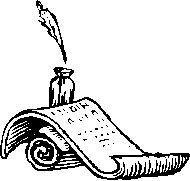

  
  

* "We can't be so fixated on our desire to preserve the rights of ordinary Americans to legitimately own handguns and rifles ... that we are unable to think about reality."  
**-- Bill Clinton, USA Today, 11 March 93, pg. 2A**  
 
* "The last time I checked, the Constitution said 'of the people, by the people and for the people'. That's what the Declaration of Independence says."  
**-- Reuters News Agency**  
** Note: actually those words are in neither of those documents, but part of The Gettysburg Address by Abraham Lincoln  
 
* "We are taking the law and bending it as far as we can to capture a whole new class of guns [to ban]"  
**-- Jose Cerda, Los Angeles Times, 22 Oct. 1997, Mr. Cerda was named as a White House Official who specializes in gun control**  
   
* "Gun registration is not enough."  
**-- Janet Reno, U.S. Attorney General, Associated Press 10 Dec 1993**  
 
* "I want to make it as hard as possible. Gun owners would have to be evaluated by how they scored on written and firing tests, and have to pass the tests in order to own a gun. And I would tax the guns, bullets and the license itself very heavily."  
**-- Jocelyn Elders, U.S. Surgeon General, Mother Jones magazine, Jan/Feb '94**  
 
* "Armas para que?" ("Guns, for what?")  
**-- Fidel Castro, a response to a Cuban citizens who said the people might need to keep their guns, after Castro announced strict gun control in Cuba**  
 
* "I have made it considerably tougher for residents to get handgun permits."  
**-- Joseph McNamara, Police Chief, San Jose, CA, in his book Safe and Sane, 1984**  
 
* "The second article of amendment (Second Amendment) to the Constitution of the United States is repealed."  
**-- U.S. House Joint Resolution 438 introduced 11 March 1992 by Congressman Owens, D-NY**  
 
* " ... we could tax them [firearms] out of existence."  
**-- Daniel Patrick Moynihan, U.S. Senator, Washington Post, 4 Nov 93**  
 
* "If it were up to me we'd ban them all [firearms]."  
**-- Mel Reynolds, U.S. Congressman, CNN Crossfire, 9 Dec 93**  
 
* "We're going to have to take this one step at a time, and the first step is necessarily - given the political realities - going to be very modest. Right now, though, we'd be satisfied not with half a loaf but with a slice. Our ultimate goal - total control of all guns- is going to take time ... The final problem is to make the possession of all handguns and all handgun ammunition - except for the military, policemen, licensed security guards, licensed sporting clubs and licensed gun collectors - totally illegal."  
**-- Nelson T. Shields III, Founder of Handgun Control, Inc., New Yorker Magazine, p. 57-58, 26 Jul 1976**  
 
* "There is no personal right to be armed for private purposes unrelated to the service in a well regulated militia."  
**-- Sarah Brady, Chairman, Handgun Control, Inc., Richmond Times-Dispatch, 6 Jun 97, pg. 6**  
 
* "We must reverse this psychology (of needing guns for home defense). WE can do it by passing a law that says anyone found in possession a handgun except a legitimate officer of the law goes to jail-period!"  
**-- Carl Rowan, Washington DC Syndicated Columnist, 1981 article**  
 
* " ... as long as authorities leave this society awash in drugs and guns, I will protect my family."  
**-- Carl Rowan, 1988 article titled "At Least They're Not Writing My Obituary"**  
 
* "Men possess handguns in order to compensate for sexual dysfunction."  
**-- Dr. Joyce Brothers, Psychiatrist, TV personality**  
** her husband is among NYC elite that has been issued a permit to carry a concealed handgun  
 
* "Those now possessing weapons and ammunition are at once to turn them over to the local police authority. Firearms and ammunition found in a Jew's possession will be forfeited to the government without compensation ... Whoever willfully or negligently violates the provisions ... will be punished with imprisonment and a fine.  
**-- Nazi Law, Regulations Against Jews' Possession of Weapons, 11 Nov 1938, German Minister of the Interior**  

