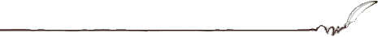

  

* "The only freedom which deserves the name, is that of pursuing our own good in our own way, so long as we do not attempt to deprive others of theirs, or impede their efforts to obtain it."   
**-- John Stuart Mill (1806 - 1873), English economist & philosopher, On Liberty, 1859.**   
   
* "It could probably be shown by facts and figures that there is no distinctly American criminal class except Congress."  
**-- Mark Twain**  
   
* "In the first place, God made idiots. That was for practice. Then he made school boards."  
**-- Mark Twain**  
   
* "It is the fundamental theory of all the more recent American law...that the average citizen is half-witted, and hence not to be trusted to either his own devices or his own thoughts."  
**-- H. L. Mencken (1880-1956) American Journalist, Editor, Essayist, Linguist, Lexicographer, and Critic**  
   
* "The whole gospel of Karl Marx can be summed up in a single sentence: Hate the man who is better off than you are. Never under any circumstances admit that his success may be due to his own efforts, to the productive contribution he has made to the whole community. Always attribute his success to the exploitation, the cheating, the more or less open robbery of others. Never under any circumstances admit that your own failure may be owing to your own weakness, or that the failure of anyone else may be due to his own defects – his laziness, incompetence, improvidence, or stupidity."  
**-- Henry Hazlitt**  
   
* "The Republican form of government is the highest form of government; but because of this it requires the highest type of human nature - a type nowhere at present existing."  
**-- Herbert Spencer Essays: Scientific, Political, and Speculative (1862)**  
   
* "Nobody ever went broke underestimating the intelligence of the American public."  
**-- H. L. Mencken US editor (1880 - 1956)**  
 
* "It is indeed probable that more harm and misery have been caused by men determined to use coercion to stamp out a moral evil than by men intent on doing evil."  
**-- Friedrich A. Hayek, The Constitution of Liberty (1960)**  
   
* "That erroneous assumption is to the effect that the aim of public education is to fill the young of the species with knowledge and awaken their intelligence, and so make them fit to discharge the duties of citizenship in an enlightened and independent manner. Nothing could be further from the truth. The aim of public education is not to spread enlightenment at all; it is simply to reduce as many individuals as possible to the same safe level, to breed and train a standardized citizenry, to put down dissent and originality. That is its aim in the United States, whatever the pretensions of politicians, pedagogues and other such mountebanks, and that is its aim everywhere else."  
**-- H. L. Mencken**  
   
* "It is inaccurate to say that I hate everything. I am strongly in favor of common sense, common honesty, and common decency. This makes me forever ineligible for public office."  
**-- H. L. Mencken (1880 - 1956)**  
   
* "No tendency is quite so strong in human nature as the desire to lay down rules of conduct for other people."  
**-- William Howard Taft, 27th president of the United States**  
   
* "If liberals were merely stupid, the laws of probability would dictate that at least some of their decisions would serve America's interests."  
**-- Joe McCarthy**  
   
* "In the end, more than freedom, they wanted security. They wanted a comfortable life, and they lost it all – security, comfort, and freedom. When the Athenians finally wanted not to give to society but for society to give to them, when the freedom they wished for most was freedom from responsibility, then Athens ceased to be free and was never free again."  
**-- Edward Gibbon (1737-1794) Decline and Fall of the Roman Empire**  
   
* "The worst crime against working people is a company which fails to operate at a profit."  
**-- Samuel Gompers**  
   
* "It is hard to imagine a more stupid or more dangerous way of making decisions than by putting those decisions in the hands of people who pay no price for being wrong."  
**-- Dr. Thomas Sowell**  
   
* "The curious task of economics is to illustrate to men how little they really know about what they imagine they can design. "  
**-- The Fatal Conceit: The Errors of Socialism, Friedrich August Hayek**  
   
* "No man's life, liberty, or property are safe while the legislature is in session. "  
**-- Mark Twain (1866)**  
   
* "It is important to remember that government interference always means either violent action or the threat of such action. The funds that a government spends for whatever purposes are levied by taxation. And taxes are paid because the taxpayers are afraid of offering resistance to the tax gatherers. They know that any disobedience or resistance is hopeless. As long as this is the state of affairs, the government is able to collect the money that it wants to spend. "  
**-- Ludwig von Mises, Human Action [1949]**  
   
* "There is one thing in the world more wicked than the desire to command, and that is the will to obey."  
**-- William K. Clifford, mathematician and philosopher (1845-1879)**  
   
* "It is no crime to be ignorant of economics, which is, after all, a specialized discipline and one that most people consider to be a 'dismal science.' But it is totally irresponsible to have a loud and vociferous opinion on economic subjects while remaining in this state of ignorance."  
**--Murray N. Rothbard, an American economist, historian and political theorist(1926-1995).**  
   
* "Prices are important not because money is considered paramount but because prices are a fast and effective conveyor of information through a vast society in which fragmented knowledge must be coordinated."  
**-- Thomas Sowell**  
   
* "The larger the island of knowledge, the longer the shoreline of wonder."  
**-- Ralph W. Sockman**  
   
* "Only a mediocre person is always at his best."  
**-- W. Somerset Maugham**  
   
* "The ultimate result of shielding men from the effects of folly is to fill the world with fools."  
**-- Herbert Spencer**  
 
* "Socialism in general has a record of failure so blatant that only an intellectual could ignore or evade it."  
**-- Thomas Sowell**  
   
* "Underlying most arguments against the free market is a lack of belief in freedom itself."  
**-- Milton Friedman**  
   
* "The inherent vice of capitalism is the unequal sharing of the blessings. The inherent blessing of socialism is the equal sharing of misery. "  
**-- Winston Churchill**  
   
* "When a true genius appears in this world you may know him by this sign, that the dunces are all in confederacy against him."  
**-- Jonathan Swift**  
   
* "It is indeed probable that more harm and misery have been caused by men determined to use coercion to stamp out a moral evil than by men intent on doing evil."   
**-- Friedrich A. Hayek**  
   
* "I don't make jokes. I just watch the government and report the facts. "  
**-- Will Rogers**  
   
* "... the only purpose for which power can be rightfully exercised over any member of a civilized community against his will is to prevent harm to others. His own good, either physical or moral, is not a sufficient warrant. He cannot rightfully be compelled to do or to forbear because it will be better for him to do so, because it will make him happier, because in the opinions of others to do so would be wise or even right. These are good reasons for remonstrating with him, or reasoning with him, or persuading him, or entreating him, but not for compelling him, or visiting him with any evil in case he do otherwise. "  
**-- John Stuart Mill, On Liberty [1859]**  
   
* "No man's life, liberty, or property are safe while the legislature is in session. "  
**-- Mark Twain (1866)**  
   
* "Find out just what people will submit to, and you have found out the exact amount of injustice and wrong which will be imposed upon them; .... The limits of tyrants are prescribed by the endurance of those whom they oppress. "  
**-- Frederick Douglass**  
   
* "The ultimate decision about what is accepted as right and wrong will be made not by individual human wisdom but by the disappearance of the groups that have adhered to the "wrong" beliefs."  
**-- F.A. Hayek**  
   
* "The sole end for which mankind are warranted, individually or collectively, in interfering with the liberty of action of any of their number, is self-protection."  
**-- John Stuart Mill**  

  